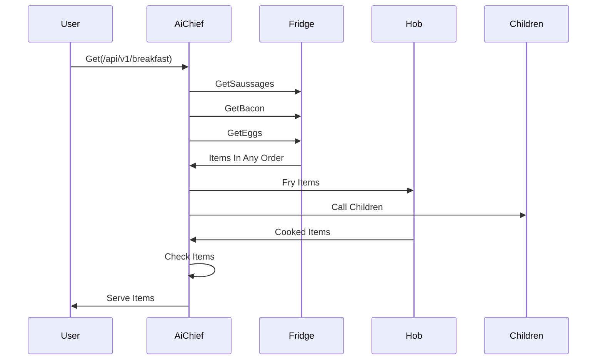

# A sample project to show how to use Micronaut with Kotlin and coroutines is amazing

## The task 

Please implement the following

## Micronaut 3.9.1 Documentation
- [Kotlin2](https://kotlinlang.org/docs/whatsnew-eap.html?_ga=2.177458981.1669192769.1683229116-1551849195.1683137848&_gl=1*kw5pgc*_ga*MTU1MTg0OTE5NS4xNjgzMTM3ODQ4*_ga_9J976DJZ68*MTY4MzIyOTExNi4yLjEuMTY4MzIyOTEyNi4wLjAuMA..#known-issues)
- [User Guide](https://docs.micronaut.io/3.9.1/guide/index.html)
- [API Reference](https://docs.micronaut.io/3.9.1/api/index.html)
- [Configuration Reference](https://docs.micronaut.io/3.9.1/guide/configurationreference.html)
- [Micronaut Guides](https://guides.micronaut.io/index.html)

---

- [Micronaut Gradle Plugin documentation](https://micronaut-projects.github.io/micronaut-gradle-plugin/latest/)
- [GraalVM Gradle Plugin documentation](https://graalvm.github.io/native-build-tools/latest/gradle-plugin.html)
- [Shadow Gradle Plugin](https://plugins.gradle.org/plugin/com.github.johnrengelman.shadow)

## Feature http-client documentation

- [Micronaut HTTP Client documentation](https://docs.micronaut.io/latest/guide/index.html#httpClient)

## Feature reactor documentation

- [Micronaut Reactor documentation](https://micronaut-projects.github.io/micronaut-reactor/snapshot/guide/index.html)

## Feature serialization-jackson documentation

- [Micronaut Serialization Jackson Core documentation](https://micronaut-projects.github.io/micronaut-serialization/latest/guide/)

